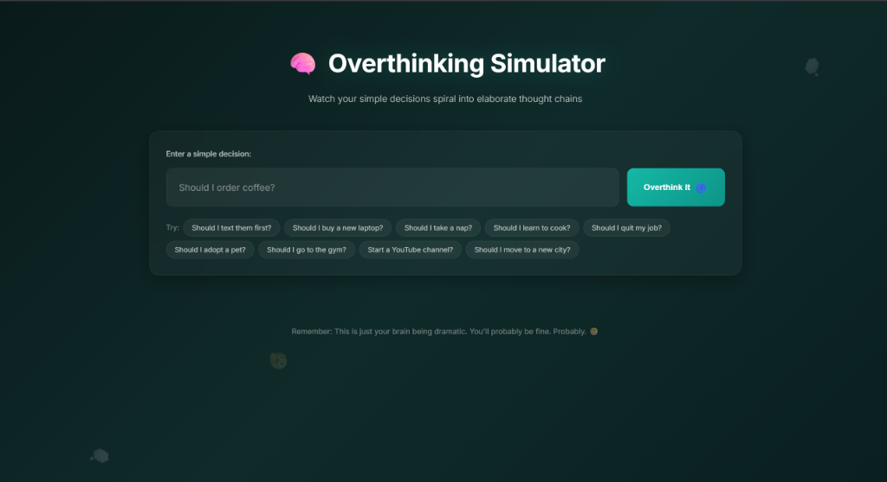
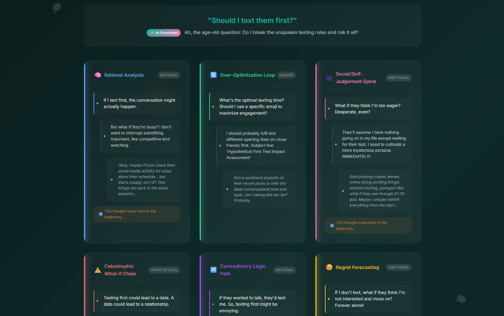
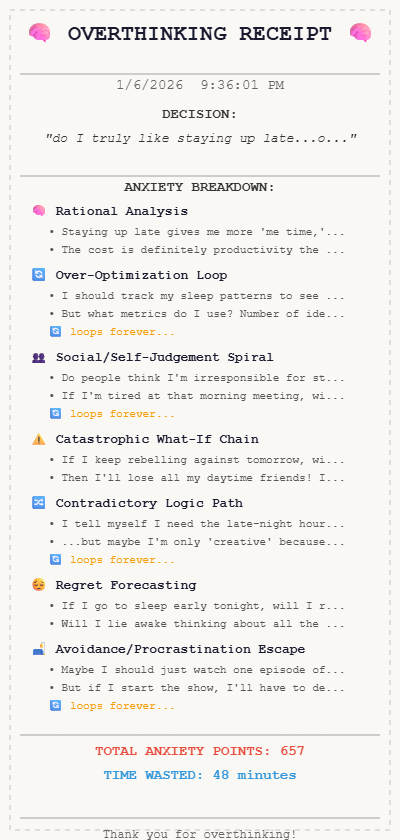

# 🧠 Overthinking Simulator

> *"It's funny because it sounds exactly like you spiraling."* - My two best friends, calling me out.

**A web app that uses AI to automate your anxiety.**

## 💻 Live Demo

👉 **[Try the Overthinking Simulator here](https://overthinking-simulator.vercel.app/)**

---

## 🔒 Source Code

This repository serves as a **public portfolio showcase**. 

The full source code (including the backend serverless functions and logic) is hosted in a **private repository** to maintain security and integrity.

If you are a recruiter or collaborator interested in seeing the code, please feel free to reach out to me directly!

---

## 🚀 Features

- **One-Input Chaos:** enter a simple thought, get a complex spiral.
- **7 Unique Logic Models:** Rational, Emotional, Catastrophic, Absurd, etc.
- **AI-Powered:** Uses Google Gemini 2.0 Flash for context-aware generation.
- **Glassmorphism UI:** Premium, responsive design with dark mode aesthetics.
- **Overthinking Receipt:** Get an itemized bill of your wasted time and anxiety points.

---

## 📸 Screenshots

### The Interface

### The Spiral Results

### The Receipt

---

## 🛠️ Tech Stack

- **Frontend:** Vanilla JS, CSS3 (Variables, Flexbox/Grid)
- **AI Integration:** Google Gemini 2.0 Flash (via OpenRouter)
- **Infrastructure:** Vercel Serverless Functions (Node.js)

---

## 📄 License

© 2026 Geo Mathew Joseph. All rights reserved.
